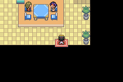
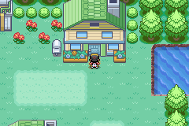
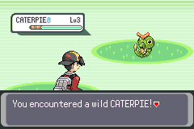
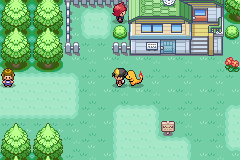
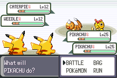
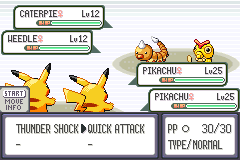

# Native-link multiplayer follow-up experiments

Status: follow-up experiments completed with the limits below, on [draft PR #144](https://github.com/mzpkdev/pokemon-wayfarer/pull/144).
This is disposable research, with the ROM changes disabled by default. It does
not approve production multiplayer, progression, or save policies.

The [first presence experiment](native-link-multiplayer-poc.md) established native
serial traffic, independent movement and Bag use, two-sided reconnect, and
emulated cable-loss recovery. This follow-up tests the missing exploration,
encounter, and persistence behavior. It starts from PoC commit
`1dbf6922e4fc45f2fd4f3018097f32e54a018219`.

## Results at a glance

| Experiment | Observed result |
| --- | --- |
| Rendering controls | Passed the longer linked, idle, and compiled-out door journeys. The earlier black interior capture was a transition fade. |
| Independent play | Bag, map travel, a complete solo battle, and one-sided reconnect passed. A presence-rate limiter fixed receive-queue saturation during solo battles. Ordinary saving still drops the session; the local save succeeds and reconnect works. |
| Cooperative encounter | Two humans chose different moves, won against NPCs, restored their distinct original parties, and saved separate rewards. The experimental release build also passed without E2E hooks. |
| Interrupted reward | Sampled partial saves loaded the previous generation after a damaged-save warning. Completed saves retained the reward and claim. An already-rewarded player could replay with an unrewarded partner without receiving another item. Full-bag rewards survived reload as pending and could be claimed after an ordinary Bag toss. |
| Compatibility | Pinned headless mGBA serial runs passed. Ordinary Qt frontends booted and loaded a save, but native multiplayer-window attempts did not establish two running games. Real GBA hardware is unavailable and untested. |

## Experimental gameplay policy

The encounter uses fixed temporary rental parties and fixed NPC opponents. This
isolates controller ownership and the native battle handoff from Wayfarer's
Trainer Rating and future co-op balancing. Original parties must be restored
before any reward save. The experiment must not grant ordinary story credit,
trainer defeat flags, facility streaks, or party experience.

Reward eligibility is local: the fixed research encounter has one reward identity
for the lifetime of each player's save. The intended reward is one Potion, with
an unclaimed/pending/claimed ledger. A full bag can retain a pending entitlement.
A successful save on one cartridge never proves the other cartridge saved.
Resetting before a durable result may require replaying the encounter; the test
must state that recovery rule instead of promising an atomic two-cartridge commit.

This fixture does not answer mixed-strength party balancing, catch ownership,
shared quest prerequisites, trade ownership, or production reward policy.

## Rendering control: the earlier black frame was a fade

The original door script started exiting soon after entering. Its retained black
screenshots sampled transition fades; they did not establish a persistent indoor
rendering defect. Longer controls stayed inside until input-relative frame 600.
In both the session-idle PoC and the build with multiplayer compiled out, the
frame-230 image was black, but the interior was visible by frame 260 and stayed
visible through frames 300, 400, and 550. The faded palette was entirely black
during the transition; the map loader reported no layout error.

This supersedes the earlier report's unresolved-black-interior interpretation.
No rendering patch was needed. The linked long-stay journey also passed: player
0 rendered inside while player 1 stayed outdoors, both kept exchanging snapshots,
and both returned to active visible presence after the exit. This establishes
this door journey in the arranged fixture; normal game initialization and other
maps remain separate checks.

At input-relative frame 400, both cartridges were active and their displays
showed different maps:

| Player 0 inside | Player 1 outside |
| --- | --- |
|  |  |

Retained controls include [linked](native-link-poc-followup/linger-linked/trace.txt),
[session idle](native-link-poc-followup/linger-poc_idle/trace.txt), and
[compiled out](native-link-poc-followup/linger-flag0/trace.txt) traces with adjacent
artifact provenance. These runs use the first-milestone ROM, before adding the
encounter and reward modules.

Reproduce from the repository root after following the
[runner dependency setup](../../game/tools/multiplayer-poc/README.md):

```sh
python3 game/tools/multiplayer-poc/run.py \
  game/pokemon-wayfarer-e2e-poc.gba game/pokemon-wayfarer-e2e-poc.elf \
  --mgba-source /tmp/wayfarer-multiplayer-poc-tools/mgba-0.10.5 \
  --mgba-build /tmp/wayfarer-multiplayer-poc-tools/build \
  --stage-e2e --stage-position 20,12 --frames 800 \
  --inputs game/tools/multiplayer-poc/map-door-linked-linger.inputs \
  --capture-frames 200,230,260,300,400,550,650,700 \
  --require-presence --output /tmp/wayfarer-door-linked
```

For the idle control, select `map-door-linger.inputs` and omit
`--require-presence`. For the compiled-out control, also use the matching
`pokemon-wayfarer-e2e.gba`/`.elf` and `--diagnostic-size 0`.

## Independent menus, maps, and solo encounters

On the integrated ROM, player 0 could open and close the Bag while player 1
moved. Both sessions stayed active. The longer house journey also passed again
with the encounter/reward modules included. Retained
[Bag](native-link-poc-followup/lifecycle/after-limiter-bag/diagnostics.json) and
[map](native-link-poc-followup/lifecycle/after-limiter-map/diagnostics.json) results include
artifact provenance and traces.

A separate case used the existing E2E command to start a wild Caterpie encounter
on player 0 only. Player 1 stayed outside and moved with their own follower.
Both continued exchanging native packets; the peer sprite was hidden while its
owner was in battle.

The first sustained battle run later filled player 0’s receive queue to 50 and
dropped the session. Sending presence every frame was too fast while battle
callbacks processed commands more slowly. The revised code sends one snapshot
per 16 main updates while either player is outside the ordinary field, with
empty command frames in between. Initial discovery and encounter negotiation
still run at full rate.

The [full battle and return](native-link-poc-followup/lifecycle/solo-wild-full-after-limiter/diagnostics.json)
then passed: player 0 fought with ordinary controller input and returned to a
visible overworld while player 1 kept moving. Receive queues peaked at 2 and 3,
and both sessions stayed active through frame 2605. Bag, the longer house
journey, and one-sided reconnect also passed with the limiter. This establishes
the tested local encounter, not every battle animation or menu in the game.

| Player 0’s solo encounter | Player 1’s overworld |
| --- | --- |
|  |  |

## Two-player cooperative encounter

Both games completed a genuine two-human-versus-NPC battle through Emerald’s
Tower multi-battle controllers. Each player consented with L+R+START while
linked in the same map. The engine briefly showed the partner party, reopened
the native link, and assigned the humans to battlers 0 and 2. Each received
three temporary level-25 rental Pokémon; the fixed opponents were level-12
Caterpie and Weedle. Fixture IVs are explicitly 20. This is a controller test,
not a proposed difficulty curve.

Player 0 selected Thunder Shock (move 84); player 1 selected Quick Attack
(move 98). Their own player-controller paths recorded those submissions and
accepted move-animation commands. Both won, exchanged matching outcomes, and
returned with their distinct original level-8 Pokémon. Original party hashes
matched exactly before and after the battle on both cartridges.

| Shared battle | Player 1 choosing Quick Attack |
| --- | --- |
|  |  |

The [first-turn diagnostics](native-link-poc-followup/final-distinct-first-turn-corrected/battle.json)
record the distinct choices. The [complete encounter](native-link-poc-followup/final-distinct-corrected/battle.json)
records the win, outcome agreement, and party restoration. The field names
`localExecutedMoves`/`localLastExecutedMove` mean accepted move-animation commands;
they do not independently prove damage or a successful hit.

The release ROM, with **no E2E code compiled in**, passed the same encounter
using imported saves, ordinary Continue, and controller input. Its
[battle](native-link-poc-followup/release-coop/battle.json) and
[reward](native-link-poc-followup/release-coop/reward.json) diagnostics agree.
The flash audits for [player 0](native-link-poc-followup/release-coop/player0-audit.json)
and [player 1](native-link-poc-followup/release-coop/player1-audit.json) found one
Potion and a claimed marker in a coherent, checksum-valid generation-2 save.
Flags, variables, original party/count, Frontier records, PC data, and the
reconstructed SaveBlock3 bytes match the exact input saves. The input saves
were prepared with the existing E2E fixture; the release run never arranged or
injected battle, outcome, or reward state.

The encounter closes the cable after result agreement and before saving.
Players must reconnect to resume shared presence. It does not keep an
uninterrupted exploration session through the reward write.

### Disconnect during the shared encounter

Removing the emulated cable during the partner party preview and, separately,
at the battle action menu aborted the encounter on both cartridges. Each
reported link loss, restored its exact original party, granted no reward, and
returned to the overworld. Ordinary input afterward moved the two players in
opposite directions. The [preview interruption](native-link-poc-followup/final-abort-walk-preview/battle.json)
and [action-menu interruption](native-link-poc-followup/final-abort-walk-action/battle.json)
retain diagnostics, traces, and artifact identities. These two timings do not
cover every animation, consent phase, or outcome-exchange race.

## Reward durability, partial writes, and replay

The flash audit checks all 14 save sectors, their checksums, and the selected
save generation. It also compares each cartridge with its own exact input save.
The Potion and two-byte claim ledger live in different sectors; their consistency
depends on a complete save generation, not a single-sector write. SaveBlock3's
extra sector payload is not checksummed by the inherited format, so comparing
its bytes does not establish corruption detection for that payload.

Each cut below followed a real controller-driven cooperative win. The harness
stopped both CPUs and exported the flash contents already written, without
letting the save finish. These are emulator interruption samples, not physical
power-loss tests or an exhaustive sweep of flash-programming times.

| Cut on player 0 | New slot on each cartridge | Selected durable state on each cartridge |
| --- | --- | --- |
| Before reward processing | No new generation | Generation 1: no Potion, no claim |
| First WRITING frame | No complete new sector set | Generation 1: no Potion, no claim |
| 100 frames into WRITING | 5 of 14 valid generation-2 sectors | Generation 1: no Potion, no claim |
| 240 frames into WRITING | 12 of 14 valid generation-2 sectors | Generation 1: no Potion, no claim |
| Save returned success | 14 of 14 valid generation-2 sectors | Generation 2: one Potion, claimed |

The [100-frame cut](native-link-poc-followup/final-cut-write100/player0-audit.json)
and [240-frame cut](native-link-poc-followup/final-cut-write240/player0-audit.json)
left a complete older generation. Fresh cores then loaded each exported save
through ordinary Continue and reached New Bark Town with the original party,
no Potion, and no claim. **The game reports a damaged save slot and requires
acknowledging the recovery warning.** This preserves playable prior progress,
but it is not a clean, warning-free recovery. The
[reloaded field](native-link-poc-followup/final-reload-write240-accepted/player0-frame2200.png)
and adjacent logs retain that observation. After the
[success cut](native-link-poc-followup/final-cut-success/player0-audit.json),
fresh-core loading retained one Potion and the claimed marker on both saves.

The [asymmetric replay](native-link-poc-followup/final-asym-replay/reward.json)
loaded player 0's already-claimed save and player 1's original unclaimed save,
then completed another real cooperative battle. Player 0 suppressed the duplicate
without writing another save; player 1 received and saved one Potion. Both
restored their original parties. Each output passed the flash audit against its
own input, including unchanged flags, variables, party/count, Frontier records,
PC data, and reconstructed SaveBlock3 bytes.

A separate [full-Medicine-pocket win](native-link-poc-followup/full-medicine-pending/reward.json)
saved PENDING on both cartridges, with no Potion and no claim. The new E2E
fixture filled all 92 Medicine slots with 999 Antidotes each before the baseline
save; it did not inject the encounter result or reward state. Both completed the
battle normally, restored their parties, and wrote coherent saves with the
pending ledger. Their unrelated saved progression matched the input saves.

A [fresh-core retry](native-link-poc-followup/pending-bag-retry-final/reward.json)
loaded those pending saves. Player 0 used the ordinary Bag menu to toss one
999-Antidote stack, returned to the field, and pressed L+R+A. The game granted
one Potion and saved CLAIMED; player 1 remained PENDING with no Potion. The
[player 0 flash audit](native-link-poc-followup/pending-bag-retry-final/player0-audit.json)
and [player 1 flash audit](native-link-poc-followup/pending-bag-retry-final/player1-audit.json)
confirmed both states and unchanged unrelated progression. The test exercises
pending recovery after reload, not just an in-memory retry.

This establishes a local, replayable entitlement for the fixed encounter. A
cartridge that loses its uncommitted reward can replay with an already-rewarded
partner. It does not establish an atomic transaction across cartridges. The
flash driver's reported-write-error screen and bag rollback path remain
source-reviewed only; stopping CPUs mid-write does not execute that error path.

## Saving during independent play

The first one-sided save stress case exposed a limit of this transport loop.
Player 0 completed an actual full flash save while player 1 kept moving. The
synchronous save blocked player 0's main callbacks for roughly 282 emulated
frames. Ordinary controller input through START → SAVE → YES reproduced the
same failure, so it is not specific to the E2E save command. Its receive queue grew to 50, and both cartridges reported a transport
failure. Each returned to independent play and hid the peer; the save itself
succeeded: its flash audit found a coherent, checksum-valid 14-sector save.
This case therefore fails continuous-session saving. After the save
finished, controller-triggered reconnect succeeded on both cartridges. A
separate one-sided departure and later reconnect also passed.

The [save failure trace](native-link-poc-followup/lifecycle/save-one-side/link.log),
[ordinary-menu corroboration](native-link-poc-followup/lifecycle/normal-menu-save-confirm/link.log),
[post-save reconnect](native-link-poc-followup/lifecycle/save-rejoin/diagnostics.json),
and [one-sided rejoin](native-link-poc-followup/lifecycle/one-sided-leave-rejoin/diagnostics.json)
retain both cartridges’ observations and adjacent ROM provenance.

A production design needs an explicit save transition: for example, end the
session before writing and reconnect afterward, or design and test a coordinated
transport pause. Increasing a timeout alone does not drain a queue while the
main loop is blocked. The encounter experiment closes the cable after agreeing
the result and before writing the reward save.

## Ordinary emulator frontends

Unmodified mGBA Qt 0.10.2 and official 0.10.5 packages both booted the
first-milestone ROM and loaded a real flash save through Continue. The 0.10.2
probe also verified movement in New Bark Town. Both probes used Xvfb and
ordinary GUI keyboard/mouse input, with isolated saves and configuration.
They did not use the custom link runner or inject emulator memory.

The native “New multiplayer window” command created two player windows in
both versions, but the second core stayed white. The 0.10.5 probe also tried
loading the second cartridge after the first reached the field, resetting the
peer, and resetting both; none established two running games. These bounded
probes establish ordinary single-player frontend operation. They do **not**
establish GUI multiplayer compatibility, even on the same mGBA version as the
successful headless link runner. The cause is unresolved; these observations
do not identify a ROM defect or establish general emulator incompatibility.

See the [0.10.2 procedure](native-link-poc-followup/gui-probe/README.txt),
[0.10.5 procedure](native-link-poc-followup/gui-probe-0105/README.txt),
[official-binary manifest](native-link-poc-followup/gui-probe-0105/manifest.json),
and [ordinary GUI gameplay capture](native-link-poc-followup/gui-probe/gui-solo-moved.png).
No packages were installed system-wide.

## Build and validation identity

The validated ROM source is recorded in the
[changed-input manifest](native-link-poc-followup/builds/validated-rom-source.json)
against commit `1dbf6922e4fc45f2fd4f3018097f32e54a018219`. The manifest was
unchanged before and after the build. The host runner uses the unmodified
mGBA 0.10.5 core library, SHA-256
`ac09dc48409e9d863a640e9429b8e24569f4eb43e2689dad4c06a66a952a603f`.
Case provenance records the ROM and ELF actually tested; earlier controls are
explicitly tied to the first-milestone ROM.

| Build | ROM SHA-256 | Static EWRAM | Static IWRAM | Linked ROM bytes |
| --- | --- | ---: | ---: | ---: |
| Default release | `a06269293728ee6ebbb9c632663292045c89b76d77e6e9f80be09352acb48099` | 249,413 | 25,612 | 31,731,080 |
| Experimental release | `69041f42cf28ee2cca58b64043111f51e19c428d20f9da8867929e724063065e` | 252,909 | 25,608 | 31,737,968 |
| Experimental E2E, before Medicine fixture | `35ade6af046e3bf976da1b47fb3df90b9722b52c367d891041ec7a0eb4cd6ff2` | 258,852 | 25,652 | 32,112,252 |
| Experimental E2E, with Medicine fixture | `c4776cacbf29a66a96cf4c29782ac148dfc96ab990bb5101cab3ae0d541a6f6a` | 258,852 | 25,652 | 32,112,332 |

The later E2E build adds only a full-Medicine-pocket arrangement capability;
its [source manifest](native-link-poc-followup/builds/medicine-fixture-rom-source.json)
records that addition. Existing co-op, interruption, and release results retain
their earlier artifact identities. The fixture is excluded from release builds.

The release experiment adds 6,888 linked ROM bytes and 3,496 static EWRAM bytes.
These are linker measurements, not peak heap/stack measurements. The default
release remains byte-identical to the compiled-out control, contains no
`MultiplayerPoc` symbols, and retains the passing
[main-menu boot check](native-link-poc-followup/builds/default-release-boot-command.log).

Build commands from the repository root, using ARM GCC 13.2.1:

```sh
make -C game -j12 BUILD=wayfarer E2E=1 WAYFARER_MULTIPLAYER_POC=1 CXX=g++ e2e-inner
make -C game -j12 BUILD=wayfarer WAYFARER_MULTIPLAYER_POC=1 CXX=g++ release
make -C game -j12 BUILD=wayfarer CXX=g++ release
```

Run these serially because build variants share generated map inputs. The
[runner guide](../../game/tools/multiplayer-poc/README.md) documents the pinned
core build, save preparation, controller scripts, diagnostics, and flash audit.
The [lifecycle commands](native-link-poc-followup/lifecycle/README.md) reproduce
the complete solo battle, Bag, door, and reconnect cases. Exact input saves
are retained in the local experiment directory and identified by hash in case
provenance; they are not committed. Regenerating fixtures can reproduce the
procedure, but does not promise byte-for-byte identical save images or timings.

An independent source review found no remaining actionable issue in the examined
consent, battle cleanup, outcome agreement, reward timing, and presence throttle.
Runtime evidence is limited to the named cases. Physical GBA hardware is
unavailable; real cable behavior remains untested.

## Implications for Wayfarer’s design

Keep exploration, encounter participation, and saving as explicit session states.
Independent exploration can keep each cartridge’s local campaign running, but
entering a shared encounter needs both players’ consent and a handoff to the
native battle controllers. The inherited Tower multi-battle path is a useful
starting point because it already distinguishes two human allies from NPC
opponents. Its party preview, reconnect, battle-end, and facility side effects
still need to be handled deliberately.

A guest’s campaign remains their own in this experiment. Temporary encounter
parties are restored locally; no host save, story flags, badges, or Trainer Rating
are imported. A local reward identity can prevent one player from receiving the
same reward twice without requiring the two cartridges to have identical saves.
That is a building block for guest rewards, not an implementation of shared story
progression or host-world visitation.

A successful battle and a durable reward are different milestones. Each player
must be able to see whether their own reward saved. If one cartridge resets
before its reward is durable, it may need to replay while the already-claimed
cartridge gets no additional item. There is no atomic save across two GBAs.
The PoC’s two-byte marker in spare SaveBlock1 space is an experimental fixture;
a production ledger needs named storage, encounter identities, and recovery rules
appropriate to the chosen gameplay design.

The tests do not establish online latency tolerance. Two emulator cores connected
by native serial scheduling are a local cable model. Internet transport, wireless
adapters, phone frontends, and physical cable timing need their own evidence.

## Physical cable checklist

Use two matching experimental release ROMs and disposable saves. Record the ROM
hash, GBA models, flashcart models/firmware, and cable type. A software-emulated
serial driver does not substitute for these observations.

1. Boot each cartridge normally and save separate games. Connect in the overworld.
2. Move independently, open and close Bag and party menus, and travel through the
   same door and back. Verify both screens and controls, not only diagnostics.
3. Leave from one side, reconnect, then unplug during exploration and a menu.
4. Enter the controlled co-op encounter, choose different moves on each GBA, and
   finish. Confirm original parties return and each eligible player gets one reward.
5. Rejoin/replay and confirm no duplicate reward for a previously claimed save.
6. On disposable saves, interrupt around reward persistence and reload both carts.
   Record each cartridge's item count and entitlement separately. Power failure
   during real flash programming is a different test from emulator soft reset.

Stop and retain the failed case if either game hangs, loses normal input, renders
incorrectly, changes unrelated progression, or loads an inconsistent item/ledger
pair. Report the exact step and both cartridges' outcomes.
