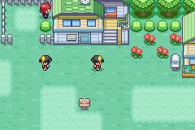
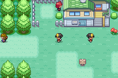
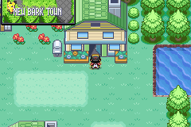

# Native-link multiplayer proof of concept

For the next session-flow batch, see [ordinary saving, menus, and reconnection](native-link-multiplayer-session-flow.md). The observations below retain their original tested-build scope.

Status: first-milestone record from PoC commit
`1dbf6922e4fc45f2fd4f3018097f32e54a018219`. Do not merge this experiment into production.
See the [follow-up experiments](native-link-multiplayer-followup.md) for later
rendering controls, independent-play, cooperative-encounter, and reward work.

This experiment follows [multiplayer research PR #143](https://github.com/mzpkdev/pokemon-wayfarer/pull/143).
It starts independently from Wayfarer commit
`3e820fb584f3bb27cafb2ee66987e575107699dc`. It does not adopt the proposed guest
progression rules or establish a production multiplayer feature.

## Question

Can two Wayfarer ROMs exchange presence through the ordinary GBA serial link
while keeping their own overworld, menus, and map transitions, then return to
solo play after a disconnect?

The ROM must use the native link interface. Emulator scripting, a network
companion, or injected received packets cannot substitute for that interface.
A headless emulator harness is test equipment; it is not a required client for
players.

## Boundaries

The experiment targets two players with matching experimental builds. It shares
presence only. Story state, badges, inventory, party, captures, Trainer Rating,
trades, cooperative battles, and rewards are not synchronized. Remote players
must not mutate local map progression or become persistent NPCs.

Use disposable saves. Physical GBA compatibility is a requirement to investigate,
not a result established by emulator tests. Internet play, wireless adapters,
cross-emulator connections, four players, host migration, and save-state rewind
are separate experiments.

## Acceptance evidence

Record the exact ROM and emulator version with each result. A successful compile
or simulated packet test does not demonstrate a linked session.

| Experiment | Required observation |
| --- | --- |
| Connect | Two separate ROM instances discover each other through native serial emulation and agree on the experimental protocol. |
| Movement | Inputs to one instance change its position and the other instance's observed peer position; the second trainer retains independent controls. |
| Menu | One player opens and closes a local menu while the other continues to move and exchange presence. |
| Map transition | A player leaves the shared map; the peer actor disappears without warping the other player, and reappears after returning. |
| Orderly disconnect | Either player can leave; both recover usable solo state without a stale peer actor. |
| Interrupted connection | Loss of the peer produces bounded recovery rather than a stuck script, reset, or save mutation. |
| Rejoin | A new session does not apply stale presence from the previous connection. |
| Default build | Experimental controls and protocol are absent when the option is disabled. |
| Physical cable | Repeat the supported journey on two real GBAs; emulator results do not satisfy this row. |

## Build and controls

The option is disabled by default. The experimental release has its own ROM
filename and object directory:

```sh
make -C game -j12 BUILD=wayfarer WAYFARER_MULTIPLAYER_POC=1 CXX=g++ release
```

This produces `game/pokewayfarer-release-poc.gba`. Use two copies of the same
build and ordinary cable emulation or physical cable hardware. In the normal
overworld, hold L+R and press SELECT on each player to connect. Use the same
chord to end the session. This is a research control, not a finished joining UI.

For the automated fixture harness, build the separately named E2E variant:

```sh
make -C game -j12 WAYFARER_MULTIPLAYER_POC=1 CXX=g++ e2e
```

This produces `game/pokemon-wayfarer-e2e-poc.gba` and matching ELF/symbol files.
The existing E2E mailbox arranges test saves; multiplayer packets still travel
through the native serial interface. `CXX=g++` selects the host compiler
available in the research environment instead of the tools' `g++-11` default.

`gMultiplayerPocDiag` exposes connection state, packet counts, local and remote
map/coordinates, and sprite visibility for observation. It has no save fields.
The handshake checks the PoC link type and protocol version; it does not verify
a ROM/content hash. Matching ROMs are a tester requirement.

## Findings

Two independently controlled Wayfarer instances exchanged position snapshots
through mGBA 0.10.5's native GBA serial emulation. The final presence run ended
with both sessions active, player IDs 0 and 1, and 452 sends / 449 receives per
player. One player moved to bordered map coordinates (18,18), the other to
(14,18); each received the other's final position. Both peer sprites were visible.
The screenshots show their expected four-tile separation with independent cameras.

| Player 0 view | Player 1 view |
| --- | --- |
|  |  |

The [raw diagnostics](native-link-poc/diagnostics.json),
[artifact hashes](native-link-poc/provenance.txt), and
[ROM source hashes](native-link-poc/source-sha256.json) identify this run. These images
are direct framebuffer captures. They demonstrate presence; they do not demonstrate
shared battles or shared progression. The automatic `--require-presence` check
asserts final connection state and coordinate agreement. Movement and rendering
were checked separately against the [initial view](native-link-poc/before-connection.png),
controller sequence, final diagnostics, and both final screenshots; a stationary
connected pair can satisfy the presence assertion.

### Scenario results

| Case | Result and evidence |
| --- | --- |
| Connection and independent movement | Passed native presence assertion; inspected initial/final images and separate controller inputs. |
| Full Bag open/close | Observed working while the peer moved. At 1,200 post-stage frames both remained active; P0 sent/received 1,140/1,137 packets, P1 1,172/1,137. [Bag capture](native-link-poc/bag-open.png). |
| Orderly leave/rejoin | Both players toggled off, then on. The trace shows the cable closed between sessions; final state active, 236/233 sends/receives each, updated positions visible. One-sided departure/rejoin is not established by this case. |
| Simulated cable removal | Detached one mGBA serial driver at input frame 240. Both games reached transport-error state, hid the peer, and advanced through emulator frame 601 in the overworld. Save durability and physical unplug behavior were not tested. |
| Map leave/return | Protocol/map updates continued. Black captures were later identified as normal transition fades by the [long-stay controls](native-link-multiplayer-followup.md#rendering-control-the-earlier-black-frame-was-a-fade). Pokémon Center exit was not covered at this milestone. |
| Default build | Build, symbol exclusion, and main-menu boot passed. |
| Physical cable / other emulators | Not tested. |

The [runner guide](../../game/tools/multiplayer-poc/README.md) gives dependency
setup and the full presence command. Use that same command with these options;
remove `--require-presence` for cable removal, where the expected final state is
disconnected. These scenario observations were reviewed from logs and images,
not enforced by a comprehensive automated assertion suite.

| Case | Additional options |
| --- | --- |
| Bag | `--inputs game/tools/multiplayer-poc/bag.inputs --frames 1200` |
| Rejoin | `--inputs game/tools/multiplayer-poc/rejoin.inputs --frames 520` |
| Cable removal | `--disconnect-frame 240 --frames 500` |
| Door | `--inputs game/tools/multiplayer-poc/map-door.inputs --stage-position 20,12 --frames 400 --capture-frames 100,145,190,230,290,360` |

Use a distinct output directory for each case. Retained [scenario logs and
summaries](native-link-poc/cases/) support these observations; each includes the
same tested ROM's provenance. The pinned harness source is identified by
[these hashes](native-link-poc/harness-sha256.json).

### Door captures: interpretation corrected by follow-up

The first house-entry sequence changed player 0's map from New Bark Town (0) to
the player's house (259), while player 1 stayed outside. Both sessions kept
exchanging packets. The black images below were originally interpreted as a
rendering failure. Longer linked, idle, and compiled-out controls showed that
these captures fall during normal entry/exit fades; the stable interior renders
correctly. See the [follow-up evidence](native-link-multiplayer-followup.md#rendering-control-the-earlier-black-frame-was-a-fade).

| Transition fade, player 0 | After exiting, player 0 |
| --- | --- |
|  |  |

Captures are at input-relative frames 290 and 360. The harness input origin is
emulator frame 101; diagnostic watch frames use absolute emulator frames.
`CB2_Overworld` can be active while a palette fade is still running, so that
callback alone does not establish a stable display state.

### Implementation lessons

The existing cable engine can carry small presence snapshots while each cartridge
runs its ordinary overworld callback. The experimental packet uses Emerald's
`LINKCMD_SEND_HELD_KEYS` envelope, adding a protocol marker/version, map ID, tile
coordinates, facing, and whether the sender is in the overworld. It sends while
stationary too. Each cartridge owns its own game; neither is a gameplay host.

Several inherited assumptions needed explicit handling:

- Normal link-room code can pause callbacks waiting for remote keys. Presence-only
  sessions need local simulation to continue so menus and disconnect timers work.
- Bag setup also waits for the link receive queue to drain. A trace caught it
  stuck at setup state 8 with four queued commands. A PoC-specific bypass lets
  ordinary menu setup proceed while the cable continues receiving snapshots.
- The E2E fixture skips the intro that normally installs the serial interrupt
  callback. Explicitly installing the existing `SerialCB` made the same startup
  work in the fixture without injecting multiplayer packets.
- Pokémon Center map loading can close an ordinary cable session. The PoC avoids
  that implicit close while its own session is active.
- Correct received coordinates do not establish correct rendering. A screenshot
  exposed missing camera offsets on the standalone peer sprite; using the normal
  overworld sprite coordinate convention fixed its placement.
- The SELECT shortcut must consume held and release frames, or the ordinary
  registered-item action opens a dialogue after connection.

### Build and resource checks

Both release variants and the E2E PoC variant built with ARM GCC 13.2.1. The
existing Wayfarer build audits passed, including the 512 KiB ROM reserve.

| Linked allocation | Default release | PoC release | Difference |
| --- | ---: | ---: | ---: |
| Used ROM bytes | 31,731,080 | 31,733,656 | +2,576 |
| Static EWRAM bytes | 249,413 | 249,521 | +108 |
| Static IWRAM bytes | 25,612 | 25,612 | 0 |

These are linked section sizes, not a runtime heap/stack or frame-time profile.
The peer sprite also uses ordinary sprite/tile/palette resources. The default
release contains no `MultiplayerPoc` symbols and booted to the main menu in the
existing mGBA smoke runner at frame 530. Release LTO renamed `CB2_MainMenu`; a
temporary `nm` wrapper supplied its unique symbol alias to that debug-oriented
runner without changing the ROM or ELF.

### What this means for Wayfarer

This establishes a small native transport and presence experiment worth building
on. It does not select the cooperative game design. A joining player currently
keeps their own map, flags, party, inventory, and story progression. There is no
host-world import, shared objective credit, reward delivery, or return-to-home
transaction. The visitor progression rules proposed in research PR #143 remain
proposals requiring a separate implementation and save/recovery experiment.

The peer is a noncolliding, generic trainer sprite with facing changes and tile
position updates. It does not replicate Wayfarer's clothing, walking animation,
subtile movement, elevation, interaction, battle state, or NPC state. It is hidden
when the peer is outside the local map or outside the overworld. No attempt is
made to secure messages against a modified cartridge.

Before a production design, test real GBA cable timing, ordinary emulator GUI
sessions, long sessions with repeated menu/map cycles, and interrupted saves.
Then prototype one cooperative objective with explicit authority and durable
reward delivery. This PoC's small packets and short successful sessions cannot
establish the resource or reliability costs of those features.
